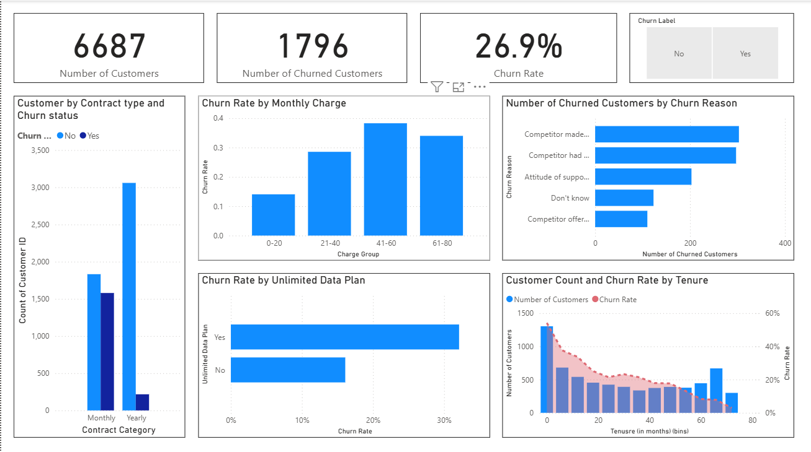

# 📊 Telecom Customer Churn Analysis Dashboard (Power BI)

## Overview

This project analyzes customer churn in a telecom company using Microsoft Power BI. The dashboard identifies key factors influencing customer churn and provides interactive visualizations to help understand customer behavior and retention patterns.

---

## Dashboard Preview

---

## Objectives

- Analyze overall customer churn.
- Identify the primary reasons customers leave.
- Compare churn across different contract types.
- Understand how customer tenure affects churn.
- Analyze the relationship between monthly charges and churn.
- Compare churn rates between customers with and without unlimited data plans.

---

## Dashboard Features

### KPI Cards
- Total Customers
- Total Churned Customers
- Overall Churn Rate

### Interactive Filter
- Churn Label

### Visualizations
- Customers by Contract Type and Churn Status
- Churn Rate by Monthly Charge Group
- Number of Churned Customers by Churn Reason
- Churn Rate by Unlimited Data Plan
- Customer Count and Churn Rate by Tenure

---

## Key Insights

- Overall customer churn rate is **26.9%**.
- Month-to-month contracts experience the highest churn.
- Competitor-related reasons account for most customer churn.
- Customers with higher monthly charges tend to churn more frequently.
- Churn decreases as customer tenure increases.
- Customers with unlimited data plans exhibit a higher churn rate.

---

## Tools & Technologies

- Microsoft Power BI
- Power Query
- DAX
- Data Modeling
- Data Visualization

---

## DAX Measures Used

Examples include:

- Churn Rate
- Number of Customers
- Number of Churned Customers
