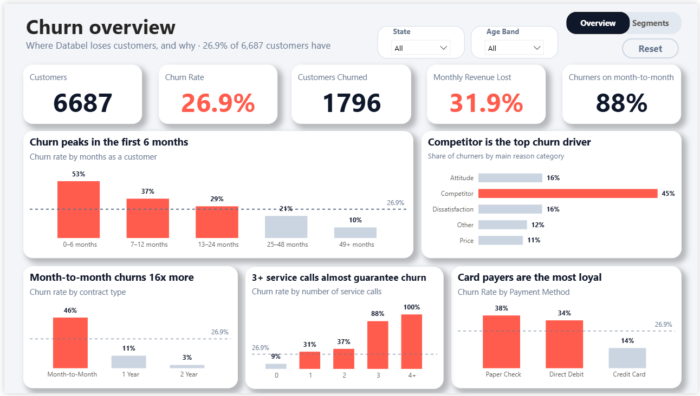
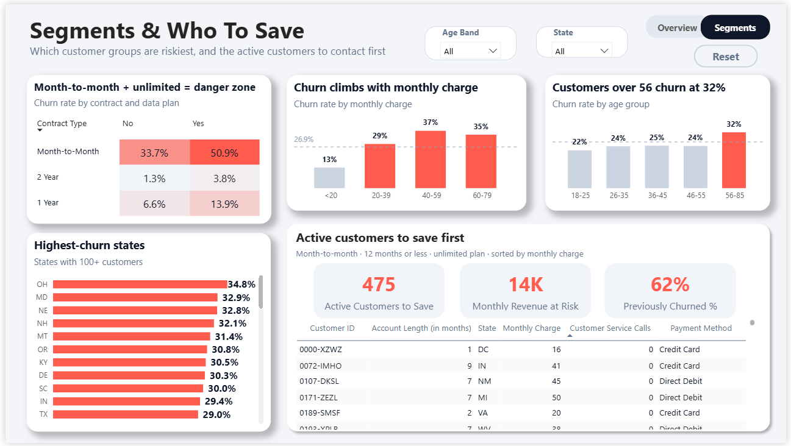

# Telecom Customer Churn Dashboard

A two-page Power BI report on 6,687 telecom customers that answers three questions: **who leaves, why, and which active customers a retention team should contact first.**




**Tools:** Power BI · DAX · Power Query  

---

## Key findings

| Finding | Number |
|---|---|
| Overall churn rate | **26.9%** (1,796 of 6,687 customers) |
| Month-to-month vs two-year contracts | **46.3%** vs **2.8%** churn |
| Share of all churners on month-to-month | **88%** |
| Share of monthly revenue lost to churn | **31.9%** (higher than the 26.9% of customers lost, so leavers pay more than average) |
| Churn in the first 6 months vs after 4 years | **53%** vs **10%** |
| Customers with 3 service calls / 4+ calls | **88%** / **~100%** churn (vs 9% with none) |
| Month-to-month + unlimited data plan | **50.9%** churn (vs 1.3% for two-year without unlimited) |
| Top reason given by churners | Competitor (**45%**) |
| Credit card vs direct debit / paper check | 14% vs 35% / 38% churn |

### Which factor matters most?

Contract type is the biggest *lever* (it covers 88% of churners), but it is not the strongest *signal*. I ranked every field by how well it separates churners from retained customers (mutual information and 5-fold cross-validated AUC, see `analysis/churn_validation.py`):

| Field | Mutual information (bits) | CV AUC |
|---|---|---|
| Customer service calls | 0.310 | 0.83 |
| Contract type | 0.170 | 0.76 |
| Tenure | 0.095 | 0.72 |
| Payment method | 0.039 | 0.62 |
| Monthly charge | 0.034 | 0.62 |

Service calls may partly be a *result* of customers who have already decided to leave, so I treat them as a warning signal, not a cause.

## Recommendations

1. **Convert month-to-month customers to annual contracts early**, ideally within the first 6 to 12 months, when churn is highest.
2. **Escalate any customer on their second service call** to a retention specialist before it reaches three.
3. **Start with the save list:** 475 active customers who are month-to-month, in their first year, on an unlimited plan (about 14K in monthly revenue). Customers matching this profile have historically churned at **62%**, and this segment accounts for **43%** of all churners.
4. **Promote credit-card autopay**, since card payers churn at less than half the rate of direct-debit and paper-check customers.

## What's in the report

**Page 1: Churn overview.** Five KPI cards, churn rate by tenure band, churn reasons (drill down from category to reason), and churn by contract type, service calls and payment method. Every rate chart has a dashed overall-average line, and bars above the average are highlighted.

**Page 2: Segments & who to save.** A contract × data-plan heat-map, churn by monthly charge and age band, the highest-churn states (100+ customers only), and a table of active customers to contact first.

Both pages have State and Age Band slicers, a Reset button and a page navigator.

## How it was built

**Power Query**
- Removed duplicate customers on `Customer ID`
- Created band columns (tenure, monthly charge, age, service calls), each with a sort-order column so bands don't sort alphabetically
- Standardised contract labels (`One Year` → `1 Year`) and filled blank churn categories with `Other`

**Key DAX measures**

```dax
Customers = COUNTROWS('Databel - Data')

Churned = CALCULATE([Customers], 'Databel - Data'[Churn Label] = "Yes")

Churn Rate = DIVIDE([Churned], [Customers])

Overall Churn Rate = CALCULATE([Churn Rate], ALL('Databel - Data'))

Revenue Lost % =
DIVIDE(
    CALCULATE(SUM('Databel - Data'[Monthly Charge]), 'Databel - Data'[Churn Label] = "Yes"),
    SUM('Databel - Data'[Monthly Charge])
)

M2M Share of Churners =
DIVIDE(
    CALCULATE([Churned], 'Databel - Data'[Contract Type] = "Month-to-Month"),
    [Churned]
)

Active Customers to Save =
CALCULATE(
    DISTINCTCOUNT('Databel - Data'[Customer ID]),
    'Databel - Data'[Contract Type] = "Month-to-Month",
    'Databel - Data'[Account Length (in months)] <= 12,
    'Databel - Data'[Unlimited Data Plan] = "Yes",
    'Databel - Data'[Churn Label] = "No"
)
```

**Design decisions**
- Compare **rates, not counts**, so large groups don't look riskier just because they're large
- One accent colour reserved for "problem" values, grey for everything else
- Chart titles state the finding ("Month-to-month churns 16x more") instead of describing the chart

## Limitations

- **One snapshot, no dates.** I can't show trends over time or build signup-month cohorts.
- **Association, not causation.** Nothing here proves a retention offer would change behaviour; that needs a test.
- **"Other" churn reason** includes 27 churners with no recorded reason.
- **The save list is a rule-based filter**, not a predictive model.
- Some segments are small (for example, 293 customers pay 60 to 79 a month), so the state chart only shows states with 100+ customers.

## Next steps

- Train a churn model (logistic regression or gradient boosting) to score active customers instead of using a rule-based filter
- Run a small A/B test of a retention offer on the save list
- Add cost data to estimate the return on each offer


---

Built by [Aakash Lodha](https://github.com/Aakash200411) · [Portfolio](https://aakash200411.github.io/Portfolio/)
